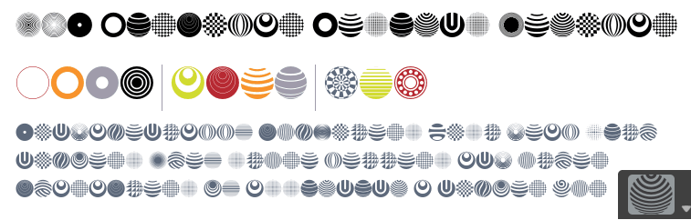

# Circles - 10 points
## Deskripsi

Some typefaces are mysterious, like this one - its origins are an enigma wrapped within a riddle, indeed.

[Circles.png](https://static.tjctf.org/f5e809c4c49f2c7d607d77c99f07bbd8e9b46dfbe61779201f5b185ed6642de3_Circles.png)


## Hint

To obtain the flag, you should find the font that was used to encode the message in the picture. If you Google the description of the problem, the first website that pops up seems promising. Using a dictionary to guess/bruteforce words without finding the font will not help you. Each circle in the image represents an alphanumeric character that is part of the flag. The brackets and the underscore in the image are NOT part of the font used to encrypt the flag.

## Flag

```
tjctf{B3auT1ful_f0Nt}
```

## Penyelesaian

Seperti hint yang telah diberikan, kita bisa mengetikkan desktipsi soal di Google lalu menambahkannya dengan kata _circle_ atau _circular_, maka akan muncul [web](https://www.fonts.com/font/ultimate-symbol/usf-circular-designs/regular) yang berisi tentang font yang digunakan dalam flag ini.

