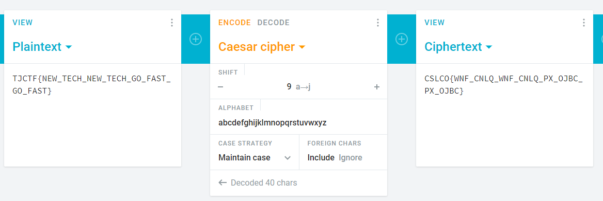

# Speedrunner - 10 points
## Deskripsi

I want to make it into the hall of fame -- a top runner in "The History of American Dad Speedrunning". But to do that, I'll need to be faster. I found some [weird parts](https://static.tjctf.org/6e61ec43e56cff1441f4cef46594bf75869a2c66cb47e86699e36577fbc746ff_encoded.txt) in the American Dad source code. I think it might help me become the best.

## Hint

SHI ZAAAAA (cipher)

## Flag

TJCTF{NEW_TECH_NEW_TECH_GO_FAST_GO_FAST}

## Penyelesaian

Jika kita lihat hint, maka jelas flag kali ini menggunakan caesar chiper.

Untuk mempercepat waktu kita bisa menggunakan online tool seperti [cryptii](https://cryptii.com/pipes/caesar-cipher). Kita coba pergeserannya dari 1 dan akhirnya ditemukan kalau dilakukan pergeseran sebanyak 9 kali.

