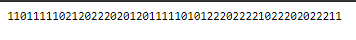
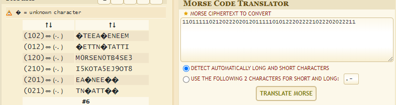

# Tap Dancing - 25 points
## Deskripsi

My friend is trying to teach me to dance, but I am not rhythmically coordinated! They sent me a list of [dance moves](https://static.tjctf.org/518d6851c71c5482dbd5bbe812b678684238c8f4e9e9b3d95a188f7db83a0870_cipher.txt) but they're all numbers! Can you help me figure out what they mean so I can learn the dance?

NOTE: Flag is not in flag format.



## Flag

```
tjctf{M0RSEN0TB4SE3}
```

## Penyelesaian

Kita bisa menggunakan [online tool](https://www.dcode.fr/morse-code) untuk mengkonversi morse chipertext.

