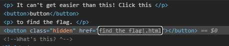

# Broken Button - 10 points
## Deskripsi

This [site](http://broken_button.tjctf.org/) is telling me all I need to do is click a button to find the flag! Is it really that easy?

## Flag

```
tjctf{wHa1_A_Gr8_1nsp3ct0r!}
```

## Penyelesaian

Inspect elemen bagian button, maka akan muncul link dimana flag berada.

